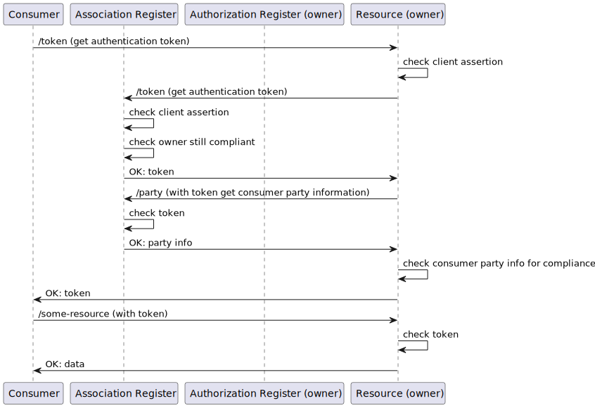

A Data Consumer wishes to access a service of a certain Service Provider. There are two ways in which Service Providers can be implemented: the minimal implementation and the full implementation.

### Minimal Implementation

The minimal implementation is simple for the Data Consumer to implement, but hard for the Service Provider. The responsibility to call the Authorization Registry falls on the Service Provider, instead of the consumer.

##### Gather Required Data

Before starting, the Data Consumer will need the following data:

- Their own ID
- A key pair
- A certificate for that key pair issued by a certificate authority supported by iSHARE
- The certificate chain
- The ID of the Service Provider they wish to access
- The URL of the Service Provider they wish to access

##### Perform Resource Request

In order to access a resource at a Service Provider, the Data Consumer should be familiar with the particular API of the Service Provider, since there is no standard for Service Provider APIs. So the consumer should be able to compose an HTTP request that conforms to the API.

When the consumer has created the HTTP request, they should add a Bearer Token to the request header. This token proves that the client is who they say they are, and that they are a valid iSHARE participant. To get the Bearer Token, the consumer must perform a token call on the Service Provider, passing a [Client Assertion](glossary.md#client-assertion) to them, which is a statement about their identity signed with their private key, and the resource they wish to access, specified by the ID of the Service Provider.

### Full Implementation

The full implementation is hard for the Data Consumer, but easy for the Service Provider. The responsibility to call the Authorization Registry falls on the Data Consumer, instead of the provider. Here are the steps necessary for a Data Consumer in order to access a resource at a Service Provider, using the full implementation.

##### Gather Required Data

Before starting, the Data Consumer will need the following data:

- Their own ID
- A key pair
- A certificate for that key pair issued by a certificate authority supported by iSHARE
- The certificate chain
- The ID of the Service Provider they wish to access
- The ID of the Association Registry
- The URL of the Association Registry

##### Perform Resource Request

The ultimate goal of the Data Consumer is to access a resource at a Service Provider, but in order to do so, a number of other actions need to be performed first.

##### Create Resource Request

The Data Consumer should be familiar with the particular API of the Service Provider, since there is no standard for Service Provider APIs. So the consumer should be able to compose an HTTP request that conforms to the API.

##### Add Delegation Evidence as Request Header

That HTTP request also needs a Delegation Evidence JWT to be accepted by the Service Provider. Usually these are added as an HTTP Request Header. This JWT proves that the client is authorized to perform certain actions on certain resources as described in the Delegation Evidence JWT. See below for how to acquire this JWT.

##### Add Bearer Token as Request Header

Another necessary HTTP Request Header is the Bearer Token. This proves that the client is who they say they are, and that they are a valid iSHARE participant. To get the Bearer Token, the consumer must perform a token call on the Service Provider, passing a [Client Assertion](glossary.md#client-assertion) to them, which is a statement about their identity signed with their private key, and the resource they wish to access, specified by the ID of the Service Provider.

##### Request Delegation Evidence from Authorization Register

To get the Delegation Evidence, the client must request it from the Authorization Registry by sending it a Delegation Mask. In return, the client will receive a (signed) Delegation Evidence JWT. The Delegation Mask is a JSON object which specifies which resource they wish to access, and which permissions they need. The Delegation Evidence can be thought of as equal to the Delegation Mask, but signed by the AR (although it does have a few extra fields)

##### Add Bearer Token as Request Header

Like all calls in an iSHARE environment, a Bearer Token is required for the delegation evidence call. To get the Bearer Token, the consumer must perform a token call on the AR, passing a client assertion to them, containing the IDs of both the consumer and the AR.

##### Request Authorization Registry Details

To get the ID and the URL of the Authorization Registry, the Data Consumer should perform a `/parties` call on the Association Registry. To make that call, the consumer will need the ID and URL of the Association Registry, the Service Provider ID, and a Bearer Token.

##### Add Bearer Token as Request Header

To get the Bearer Token, the consumer must perform a token call on the Association Registry, passing a client assertion to them, containing the IDs of the consumer and the Association Registry.

#### Sequence Diagram Without Authorization

#### Sequence Diagram Without Pre-Authorization

#### Sequence Diagram With Pre-Authorization

